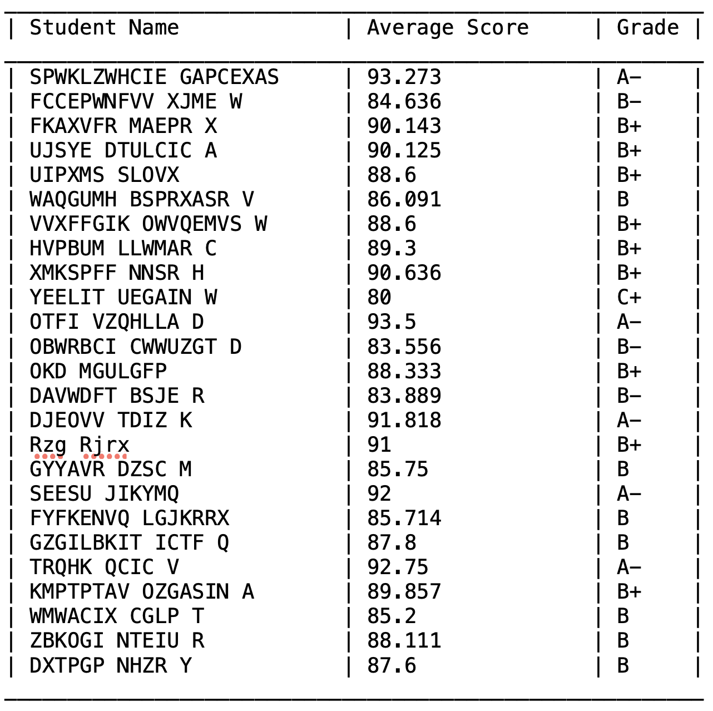
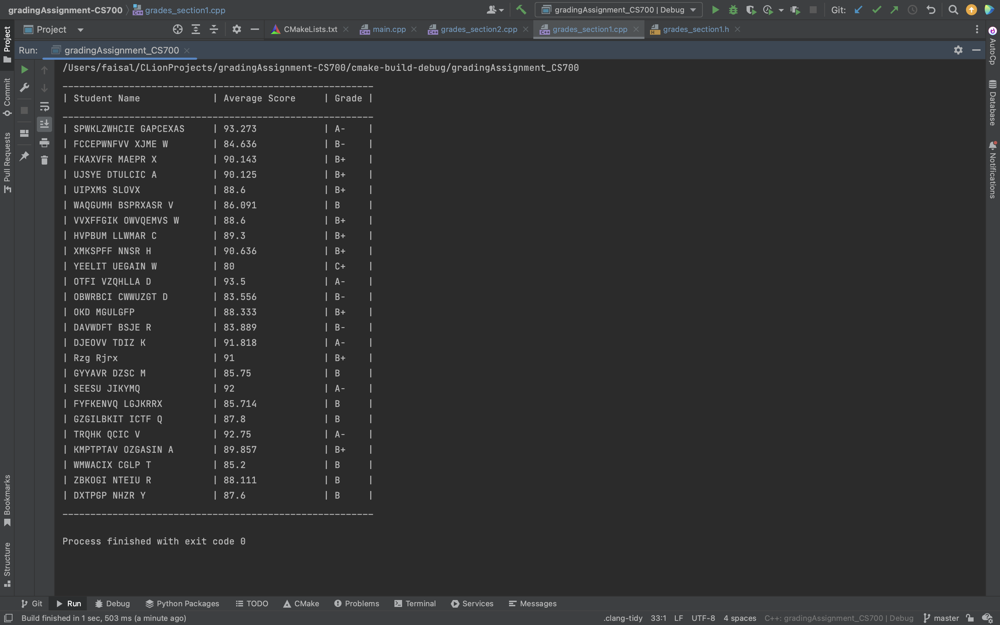
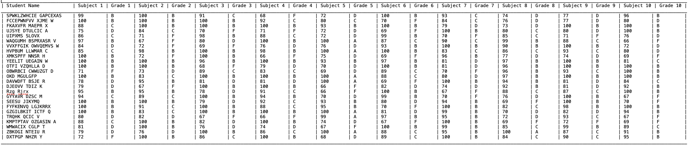

@mainpage

## Getting Started
#### This assignment contains a program to read student names and scores from a file to calculate average score and grades. The program contains the following: 

### 1. Main file containing both modules.
> Contents -
>> 1. main.cpp
> Usage - 
>> Running the main() function will run both the modules. Both modules will run consecutively.
 
### 2. Module 1 - Calculating Average score and Grades of Students.
> Contents - 
>> 1. grades_section1.cpp
>> 2. grades_section1.h
> Usage - 
>> Running this program will print name and calculated score average and grade of each student. Firstly a function will read the data line by line. Another function will calculate average score and grades based on average score.
> Output - 
>> 1. File output
        
>> 2. Console Output 
        
>> 3. [Output txt file](output_Grades.txt)
 
### 3. Module 2 - Calculating Average subject score and grades for every subject of every student.
> Contents - 
>> 1. grades_section2.cpp
>> 2. grades_section2.h
> Usage - 
>> Running this program will print name and score and grade of each student for every subject. Firstly a function will read the first line to get the number of students and number of subjects. Then another function will rest of the lines in the file and parse name in a linear string array, each subject score in 2D int pointer array, average score of each subject in a linear float array and grade for each subject score for every student in a 2D char pointer array. Lastly, a function will write all the data to output file in a well formatted fashion.
> Output - 
>> 1. File output
        
>> 2. [Output txt file](output_Grades_Section2.txt)
