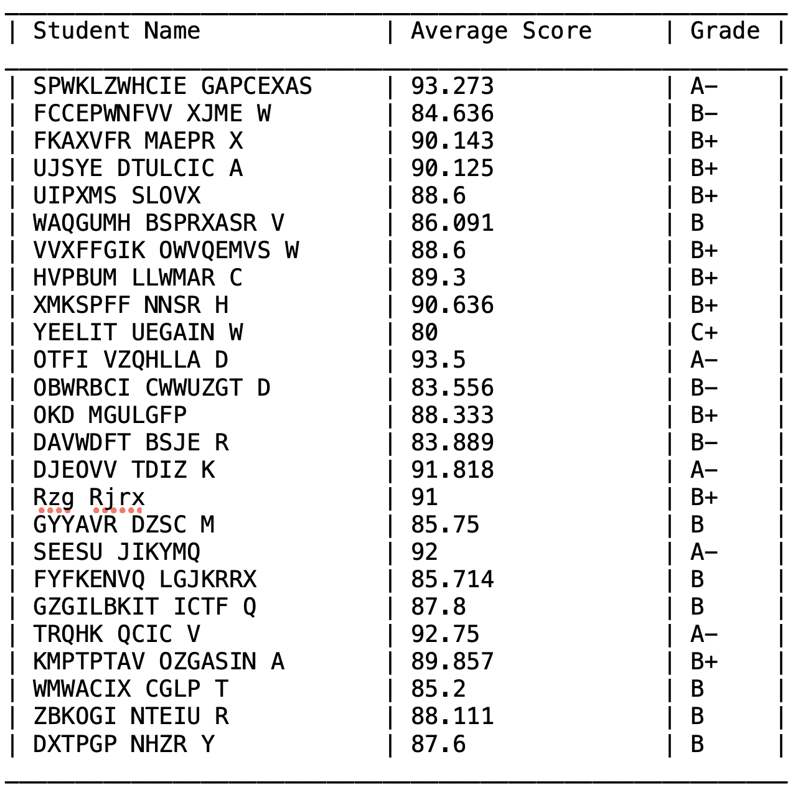
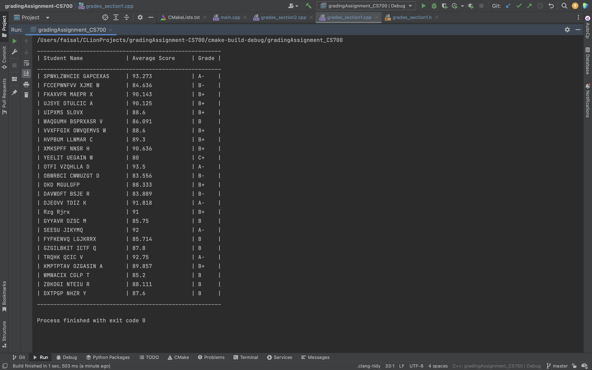
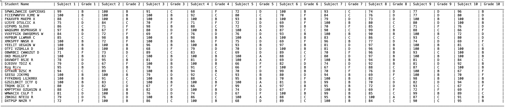

# CS-700 Assignment 1

## Getting Started
#### This assignment contains a program to read student names and scores from a file to calculate average score and grades. The program contains the following: 

### 1. Main file containing both modules.
### Contents -
1. [Main CPP File](main.cpp)
### Usage - 
#### Running the main() function will run both the modules.
  
### 2. Module 1 - Calculating Average score and Grades of Students.
#### Contents - 
1. [Grades Section 1 CPP File](grades_section1.cpp)
2. [Grades Section 1 Header File](grades_section1.h)
### Usage - 
#### Running this program will print name and calculated score average and grade of each student.
### Output - 
1. File output
        
2. Console Output 
        
3. [Output txt file](output_Grades.txt)

  
### 3. Module 2 - Calculating Average subject score and grades for every subject of every student.
#### Contents - 
1. [Grades Section 2 CPP File](grades_section2.cpp)
2. [Grades Section 2 Header File](grades_section2.h)
### Usage - 
#### Running this program will print name and score and grade of each student for every subject.
### Output - 
1. File output
        
2. [Output txt file](output_Grades_Section2.txt)
